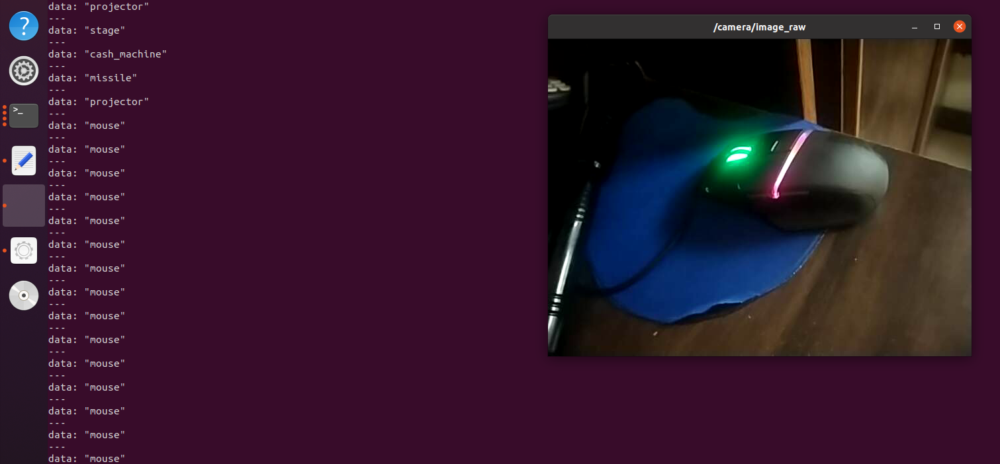
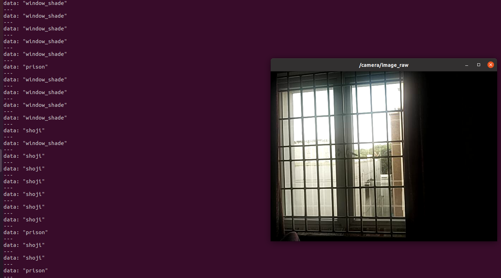

# A Live Object Recognition package in ROS Using Keras & Tensorflow
 

This ROS package is a simple live object recognizer using Transfer learning in Keras(Refer this link for more pretrained architectures for ImageNet :https://keras.io/api/applications/). 

## Requirements

* ROS
   - #### *Immediate Dependencies:*
     - cv_bridge (You can install it as follows)
      ```
       $ sudo apt-get install ros-<ROS version name>-cv-bridge 
      ```
      and
      ```
       $ sudo apt-get install ros-<ROS version name>-vision-opencv
      ```
     - rospy
     - sensor_msgs
     - std_msgs

          
    
* Tensorflow and Keras
* (Optional)CUDA support (refer to this link for proper version compatibility with your TF version : https://www.tensorflow.org/install/source#gpu)
* A webcam ( I don't have one in my laptop, hence I connected my mobile phone's camera to the laptop via Wifi using Droidcam : https://www.dev47apps.com/droidcam/linux/ (Ubuntu install) and have the Android app DroidCam installed in your phone too!)
* Camera drivers for ROS 
 ```
 $ rosdep install camera_calibration
 ```

## How to setup the package

Make sure you add the package and <code>catkin_make</code> it before running the following commands in different terminals (make sure you have sourced your catkin workspace too :
<code>source ~/catkin_ws/devel/setup.bash</code> )

*Terminal 1* : <code> roscore </code> <br /> 
(The ROS master node starts)

*Terminal 2*: <code>  roslaunch object_recognition main.launch   </code>   <br /> 
(The 'camera/image_raw' live webcam video must be showed by now)
*Terminal 3*: <code>  rosrun object_recognition classifier_CNN.py </code>  <br/>
()


*Terminal 4*:  <code>  rostopic echo /object_detected  </code>
*Terminal 5*:  <code>  rostopic echo /object_detected_probability </code>

## Workflow of the project
* The callback function fires when a new image is available. 
* Use cv_bridge to convert the image from a ROS image type to an OpenCV image type.
* Resize the image to the shape required by Xception, 299 x 299.( *You can experiment with any model from the available Deep learning models in Keras : https://keras.io/api/applications/*) 
* Read the OpenCV image in as a NumPy array.
* Expand the array into the size needed for TensorFlow.
* Convert the data from uint8 to float64.
* Normalize the data.
* Run the model and classify the image.
* Decode the prediction and convert them to appropriate data types.
* Publish the prediction.


## Demo working:
The recognition detecting some objects :
 * **Mouse detected :** 

 
 Above figure shows the mouse being detected in the topic as seen in terminal. We also see the probability or confidence level with which the recognizer thinks this is a mouse :
  

  * **Laptop detected :** 

 
 Above figure shows the laptop being detected in the topic as seen in terminal. We also see the probability or confidence level with which the recognizer thinks this is a laptop :
  

 * Lol, **Shuji** it seems ! 

 
